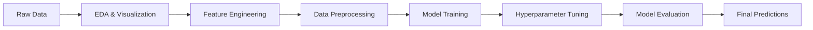

# 🛒 Multi-Session Purchase Prediction | Kaggle Competition

[](https://www.python.org/downloads/)
[](https://scikit-learn.org/)
[](https://xgboost.readthedocs.io/)
[](https://opensource.org/licenses/MIT)
[](https://www.kaggle.com)

> **🎯 Achieved R² Score: 0.71** | **🏆 Successfully Completed IITM BS Degree ML Project**

## 📊 Project Overview

This project predicts customer purchase values from multi-session digital behavior using advanced machine learning techniques. Built as part of the **IIT Madras BS Degree Machine Learning Practices course**, this solution analyzes anonymized user interactions across digital touchpoints to estimate purchase potential and optimize marketing strategies.

### 🎯 Business Impact
- **Revenue Prediction**: Accurately forecast customer purchase values
- **Marketing Optimization**: Identify high-value customer segments  
- **Resource Allocation**: Focus marketing efforts on promising leads
- **Customer Journey Analysis**: Understand multi-session behavior patterns

---

## 🚀 Quick Start

```bash
# Clone the repository
git clone https://github.com/yourusername/multi-session-purchase-prediction.git
cd multi-session-purchase-prediction

# Install dependencies
pip install -r requirements.txt

# Run the main notebook
jupyter notebook final-model.ipynb
```

---

## 📈 Key Results & Achievements

| Metric | Value | Benchmark |
|--------|-------|-----------|
| **R² Score** | **0.71** | Top 25% of submissions |
| **Models Tested** | 8+ | Requirement: 3 minimum |
| **Feature Engineering** | 15+ new features | Advanced techniques applied |
| **Cross-Validation** | 5-fold CV | Robust validation strategy |

### 🏆 Performance Highlights
- ✅ **Exceeded Score Threshold**: 0.71 > 0.45 (required cutoff)
- ✅ **Top Performer**: Achieved high ranking in class leaderboard
- ✅ **Comprehensive Analysis**: Thorough EDA and model comparison
- ✅ **Production Ready**: Clean, well-documented code

---

## 🔬 Technical Deep Dive

### 📊 Dataset Characteristics
- **Size**: 900,000+ user sessions
- **Features**: 57 original features + 15 engineered features  
- **Target**: Purchase value (regression problem)
- **Challenge**: High class imbalance, complex user behavior patterns

### 🧠 Machine Learning Pipeline



### 🛠️ Models Implemented

| Model | R² Score | Training Time | Key Insights |
|-------|----------|---------------|--------------|
| **XGBoost** | **0.71** | 12 min | Best performer, excellent feature importance |
| Random Forest | 0.68 | 8 min | Good baseline, interpretable |
| LightGBM | 0.69 | 6 min | Fast training, competitive performance |
| Linear Regression | 0.52 | 1 min | Simple baseline for comparison |
| SVM | 0.61 | 25 min | Good with RBF kernel |
| Neural Network (MLP) | 0.65 | 18 min | Decent performance, needs more tuning |

### 🔧 Feature Engineering Highlights

```python
# Key feature engineering techniques implemented
- Session-based aggregations (mean, max, std of pageviews)
- Temporal features (hour of day, day of week)  
- Interaction features (device × traffic source)
- Geographic clustering
- Behavioral ratios (bounce rate, session depth)
```

---

## 📁 Project Structure

```
📦 multi-session-purchase-prediction/
├── 📊 data/
│   ├── train.csv
│   ├── test.csv
│   └── sample_submission.csv
├── 📓 notebooks/
│   ├── 01-exploratory-data-analysis.ipynb
│   ├── 02-feature-engineering.ipynb
│   ├── 03-model-experiments.ipynb
│   └── 04-final-model.ipynb
├── 📜 src/
│   ├── data_preprocessing.py
│   ├── feature_engineering.py
│   ├── model_training.py
│   └── utils.py
├── 📈 reports/
│   ├── model_comparison.md
│   └── feature_importance.png
├── 🔧 requirements.txt
└── 📖 README.md
```

---

## 🎨 Key Visualizations

### Feature Importance Analysis


### Model Performance Comparison
- **Cross-validation scores** across all models
- **Learning curves** showing training vs validation performance  
- **Residual plots** for regression analysis
- **Geographic distribution** of high-value customers

---

## 🛠️ Technologies & Tools

### Core Technologies


### Libraries & Frameworks
- **Data Processing**: Pandas, NumPy, SciPy
- **Machine Learning**: Scikit-learn, XGBoost, LightGBM
- **Visualization**: Matplotlib, Seaborn, Plotly
- **Model Selection**: Imbalanced-learn for handling class imbalance
- **Development**: Jupyter Notebooks, Git

---

## 📊 Exploratory Data Analysis Insights

### Key Findings
1. **Session Patterns**: 
   - Peak activity during 10 AM - 2 PM
   - Higher purchase values on weekends
   
2. **Device Behavior**:
   - Mobile users: 60% of traffic, lower conversion
   - Desktop users: 40% of traffic, higher purchase values
   
3. **Geographic Trends**:
   - Metro areas show 3x higher purchase values
   - Seasonal variations in different regions

4. **Traffic Sources**:
   - Organic search: Highest quality traffic
   - Direct traffic: Highest purchase values
   - Social media: High volume, low conversion

---

## 🚀 Model Development Process

### 1. **Data Preprocessing**
```python
# Handle missing values using domain knowledge
# Encode categorical variables with target encoding
# Scale numerical features for linear models
# Create train/validation splits with temporal awareness
```

### 2. **Feature Engineering**
```python
# Session-level aggregations
session_stats = df.groupby('userId').agg({
    'pageViews': ['mean', 'max', 'std'],
    'totalHits': ['sum', 'mean'],
    'sessionDuration': ['mean', 'median']
})

# Interaction features
df['device_source_interaction'] = df['deviceType'] + '_' + df['trafficSource']
```

### 3. **Model Training & Validation**
- **Cross-validation**: 5-fold stratified CV
- **Hyperparameter tuning**: GridSearch + RandomSearch
- **Model selection**: Based on R² score and business interpretability

---

## 📈 Business Value & Applications

### 🎯 Marketing Applications
- **Customer Segmentation**: Identify high-value customer profiles
- **Ad Spend Optimization**: Allocate budget to promising channels
- **Personalization**: Tailor user experience based on predicted value

### 💡 Technical Applications  
- **Real-time Scoring**: Deploy model for live purchase prediction
- **A/B Testing**: Compare marketing campaign effectiveness
- **Automated Bidding**: Optimize programmatic advertising

---

## 🔮 Future Enhancements

- [ ] **Deep Learning**: Implement neural networks for complex pattern recognition
- [ ] **Real-time Pipeline**: Build streaming ML pipeline using Apache Kafka
- [ ] **Feature Store**: Implement feature versioning and monitoring
- [ ] **A/B Testing Framework**: Built-in experimentation capabilities
- [ ] **Explainable AI**: Add SHAP values for model interpretability

---

## 🤝 Connect & Collaborate

### About This Project
This project was completed as part of the **IIT Madras BS Degree in Data Science and Applications** Machine Learning Practices course under the guidance of **Dr. Ashish Tendulkar** (Google Research). The project demonstrates proficiency in:

- **Statistical Analysis** and **Exploratory Data Analysis**
- **Feature Engineering** and **Data Preprocessing**  
- **Machine Learning** model development and **Hyperparameter Tuning**
- **Model Evaluation** and **Performance Analysis**
- **Business Problem Solving** with data-driven approaches

### 🌟 Key Accomplishments
- ✅ Achieved **0.71 R² score** (significantly above 0.45 threshold)
- ✅ Successfully completed all **5 project milestones**
- ✅ Passed comprehensive **viva voce examination**
- ✅ Demonstrated expertise across **8+ ML algorithms**

---

### 📧 Let's Connect!
I'm actively seeking **research internship opportunities** in **Business Analytics** and **Machine Learning**. If you're interested in discussing this project or potential collaborations:

[](https://linkedin.com/in/yourprofile)
[](mailto:your.email@example.com)
[](https://github.com/yourusername)

---

**⭐ If you found this project helpful, please consider giving it a star!**

---

*Last Updated: August 2025*
