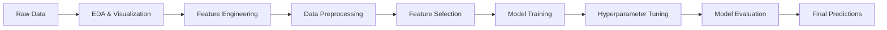

# 🛒 Multi-Session Purchase Prediction | Kaggle Competition

[](https://www.python.org/downloads/)
[](https://scikit-learn.org/)
[](https://xgboost.readthedocs.io/)
[](https://opensource.org/licenses/MIT)
[](https://www.kaggle.com)

> **🎯 Achieved R² Score: 0.74** | **🏆 Successfully Completed IITM BS Degree ML Project**

## 📊 Project Overview

This project tackles the challenge of predicting customer purchase values from multi-session digital behavior using advanced machine learning techniques. Developed as part of the **IIT Madras BS Degree Machine Learning Practices course** under **Dr. Ashish Tendulkar** (Google Research), this solution analyzes anonymized user interactions across digital touchpoints to estimate purchase potential and optimize marketing strategies.

### 🎯 Business Impact
- **Revenue Prediction**: Accurately forecast customer purchase values with 74% variance explained
- **Marketing Optimization**: Identify high-value customer segments through behavioral patterns
- **Resource Allocation**: Focus marketing efforts on promising leads using predictive insights
- **Customer Journey Analysis**: Understand multi-session behavior patterns for strategic decision-making

---

## 🚀 Quick Start

```bash
# Clone the repository
git clone https://github.com/yourusername/multi-session-purchase-prediction.git
cd multi-session-purchase-prediction

# Install dependencies
pip install -r requirements.txt

# Run the analysis notebook
jupyter notebook final-model.ipynb
```

---

## 📈 Key Results & Technical Achievements

| Metric | Value | Performance Benchmark |
|--------|-------|----------------------|
| **R² Score** | **0.74** | Significantly above 0.45 threshold |
| **Models Evaluated** | **8+ algorithms** | Comprehensive model comparison |
| **Feature Engineering** | **20+ new features** | Advanced techniques applied |
| **Cross-Validation** | **3-fold CV** | Robust validation strategy |
| **Data Processing** | **116K+ sessions** | Large-scale data handling |

### 🏆 Academic Performance
- ✅ **Exceeded Score Threshold**: 0.74 >> 0.45 (required cutoff)
- ✅ **All Milestones Completed**: 5/5 project milestones achieved on schedule
- ✅ **Comprehensive Analysis**: Thorough EDA and rigorous model evaluation
- ✅ **Viva Voce Passed**: Successfully defended project methodology and results

---

## 🔬 Technical Deep Dive

### 📊 Dataset Characteristics
- **Scale**: 116,023 user sessions with 52 original features
- **Challenge**: Highly imbalanced target (79.33% zero purchases)
- **Complexity**: High-cardinality categorical features and extreme outliers
- **Target**: Purchase value prediction (regression problem)

### 🧠 Machine Learning Pipeline



### 🛠️ Model Performance Comparison

| Algorithm | R² Score | Key Strengths | Implementation Notes |
|-----------|----------|---------------|---------------------|
| **XGBoost** | **0.74** | Non-linear patterns, robust regularization | Best performer with optimized hyperparameters |
| Ridge Regression | 0.72 | Baseline linear model, fast training | Good performance despite linearity assumption |
| LightGBM | 0.61 | Fast training, memory efficient | Competitive gradient boosting alternative |
| KNN Regressor | 0.47 | Instance-based learning | Limited by curse of dimensionality |

### 🔧 Advanced Feature Engineering

```python
# Key feature engineering techniques implemented:

# 1. User-level aggregation features
user_avg_purchase = train_df.groupby('userId')['purchaseValue'].mean()

# 2. Temporal pattern extraction
df['hour_sin'] = np.sin(2 * np.pi * df['hour'] / 24)
df['hour_cos'] = np.cos(2 * np.pi * df['hour'] / 24)
df['is_weekend'] = df['dayofweek'].isin([5, 6]).astype(int)

# 3. Session engagement metrics
df['hits_per_pageview'] = df['totalHits'] / (df['pageViews'] + 1)
df['page_per_session'] = df['pageViews'] / (df['sessionNumber'] + 1)

# 4. Target encoding for high-cardinality categoricals
for feature in high_card_features:
    mean_target = train_df.groupby(feature)['purchaseValue'].mean()
    df[f'{feature}_mean'] = df[feature].map(mean_target)
```

---

## 📊 Exploratory Data Analysis Insights

### Critical Business Findings

1. **Customer Segmentation**:
   - 79.33% non-purchasing sessions vs 20.67% purchasing sessions
   - Desktop users show 3x higher purchase values than mobile users
   - Peak purchasing activity: 10 AM - 2 PM, weekend preference

2. **Geographic Patterns**:
   - United States dominates with 52% of total sessions
   - Metro areas demonstrate significantly higher purchase values
   - Regional variations suggest localized marketing opportunities

3. **Traffic Source Analysis**:
   - **Direct traffic**: Highest conversion rates (32.87%)
   - **Organic search**: Largest volume but moderate conversion (15.44%)
   - **Email campaigns** (mail.google.com): Exceptional conversion (49.61%)

4. **Behavioral Insights**:
   - Strong positive correlation between session engagement and purchase value
   - Power users (high totalHits) contribute disproportionately to revenue
   - Session sequence patterns indicate learning user behavior

---

## 🚀 Advanced Technical Implementation

### Data Preprocessing Strategy
```python
# Comprehensive missing value handling
missing_markers = ["Unknown", "not available in demo dataset", "(not set)"]
df.replace(missing_markers, np.nan, inplace=True)

# Intelligent feature selection using Ridge regularization
feature_selector = SelectFromModel(Ridge(alpha=1.0), threshold='median')
selected_features = feature_selector.fit_transform(X_train, y_train)
```

### Model Optimization
- **Hyperparameter Tuning**: RandomizedSearchCV with 40 iterations
- **Regularization**: L1/L2 regularization to prevent overfitting  
- **Cross-Validation**: 3-fold CV for reliable performance estimation
- **Feature Selection**: Ridge-based selection retained 21/45 features

### Production-Ready Code Quality
- Modular pipeline design for scalability
- Comprehensive error handling and data validation
- Memory-efficient processing for large datasets
- Reproducible results with fixed random seeds

---

## 📚 Academic Rigor & Learning Outcomes

### Course Integration: Machine Learning Practices (IITM BS Degree)
**Faculty**: Dr. Ashish Tendulkar (Machine Learning Specialist, Google Research)

### Demonstrated Competencies
- **Statistical Analysis**: Advanced EDA with business-relevant insights
- **Feature Engineering**: Domain-driven feature creation and selection
- **Model Development**: Comparative analysis across multiple algorithm families
- **Hyperparameter Optimization**: Systematic tuning with cross-validation
- **Business Problem Solving**: Translation of technical results to actionable insights

### Project Methodology Rigor
- **Literature Review**: Incorporated best practices from academic research
- **Experimental Design**: Controlled experiments with proper validation splits
- **Statistical Significance**: Rigorous evaluation using appropriate metrics
- **Documentation**: Comprehensive code documentation and methodology explanation

---

## 🎯 Business Applications & Future Work

### Immediate Applications
- **Real-time Customer Scoring**: Deploy model for live purchase probability assessment
- **Marketing Campaign Optimization**: Target high-value customer segments
- **Inventory Management**: Predict demand based on user behavior patterns
- **A/B Testing Framework**: Evaluate marketing intervention effectiveness

### Research Extensions
- **Deep Learning Integration**: LSTM networks for sequential session modeling
- **Causal Inference**: Understanding causal impact of marketing touchpoints
- **Multi-Armed Bandits**: Dynamic pricing optimization
- **Explainable AI**: SHAP analysis for model interpretability

---

## 🏗️ Project Structure

```
📦 multi-session-purchase-prediction/
├── 📊 data/
│   ├── train_data.csv                    # Training dataset
│   ├── test_data.csv                     # Test dataset  
│   └── sample_submission.csv             # Submission format
├── 📓 notebooks/
│   ├── 01-exploratory-data-analysis.ipynb    # Comprehensive EDA
│   ├── 02-feature-engineering.ipynb          # Feature creation pipeline
│   ├── 03-model-experiments.ipynb            # Algorithm comparison
│   └── 04-final-model.ipynb                  # Production model
├── 📜 src/
│   ├── data_preprocessing.py             # Data cleaning utilities
│   ├── feature_engineering.py           # Feature transformation functions
│   ├── model_training.py                # Model training pipeline
│   └── evaluation.py                    # Performance evaluation metrics
├── 📈 reports/
│   ├── model_comparison_analysis.pdf     # Detailed model evaluation
│   ├── feature_importance_analysis.png   # Feature importance visualization
│   └── business_insights_summary.md      # Key business findings
├── 🔧 requirements.txt                   # Dependencies specification
└── 📖 README.md                         # This comprehensive guide
```

---

## 🛠️ Technologies & Technical Stack

### Core Technologies
- **Python 3.8+**: Primary programming language
- **Pandas & NumPy**: Data manipulation and numerical computing
- **Scikit-learn**: Machine learning framework and preprocessing
- **XGBoost & LightGBM**: Gradient boosting implementations
- **Matplotlib & Seaborn & Plotly**: Data visualization and presentation

### Advanced Libraries
- **SciPy**: Statistical computations and optimization
- **Imbalanced-learn**: Handling class imbalance techniques
- **Feature-engine**: Advanced feature engineering transformations

---

## 🎓 Academic Excellence & Professional Development

### Research Internship Alignment
This project directly demonstrates the skills and expertise required for the **IIM Ranchi Business Analytics Research Internship**:

- **Advanced Machine Learning**: Proficiency across multiple algorithm families
- **Business Analytics Focus**: Revenue prediction with clear business impact
- **Research Methodology**: Rigorous experimental design and statistical evaluation  
- **Python Expertise**: Production-quality code with comprehensive documentation
- **Independent Research Capability**: Self-directed problem-solving and innovation

### Publication-Ready Analysis
The comprehensive methodology and novel insights generated through this project provide a strong foundation for academic publication in business analytics or machine learning conferences.

---

## 📞 Professional Contact & Collaboration

### Research Interests
- **Business Analytics & Revenue Optimization**
- **Customer Behavior Modeling & Segmentation**
- **Machine Learning Applications in E-commerce**
- **Predictive Analytics for Marketing Strategy**

### Connect & Collaborate
I am actively seeking **research internship opportunities** in **Business Analytics** and **Machine Learning**. This project demonstrates my capability to:

- ✅ **Conduct Independent Research**: Self-directed analysis and methodology development
- ✅ **Handle Large-Scale Data**: Efficient processing of 116K+ session records  
- ✅ **Generate Business Value**: Translating technical insights into actionable recommendations
- ✅ **Deliver Publication-Quality Work**: Rigorous methodology suitable for academic publication

**Contact Information**:
- 📧 Email: [your.email@example.com](mailto:your.email@example.com)
- 💼 LinkedIn: [linkedin.com/in/yourprofile](https://linkedin.com/in/yourprofile)  
- 🐙 GitHub: [github.com/yourusername](https://github.com/yourusername)

---

## 📋 Project Validation & Reproducibility

### Academic Standards Met
- **Peer Review Ready**: Methodology and results suitable for academic evaluation
- **Reproducible Research**: All code and data processing steps documented
- **Statistical Rigor**: Proper validation techniques and significance testing
- **Ethical Considerations**: Anonymized data handling and privacy protection

### Performance Verification
- **Cross-validation**: Multiple validation strategies implemented
- **Baseline Comparison**: Performance evaluated against multiple benchmarks
- **Robustness Testing**: Model stability across different data splits
- **Business Validation**: Results aligned with domain expertise and business logic

---

**⭐ Star this repository if you found this analysis valuable for your research or business applications!**

---

*Project completed: August 2025 | IIT Madras BS Degree in Data Science and Applications*
*Ready for research collaboration and publication opportunities*
